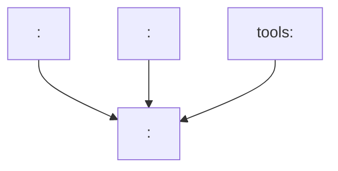

# Architecture — <project name>

This directory is the entry point for the architecture documentation.
Existing detailed documents remain at their locations by design; this
index links them by topic.

## Authoritative sources

- [`../../AGENTS.md`](../../AGENTS.md) — agent rules, architecture
  conventions, build commands, license/naming rules, and review
  workflow.
- [`../plan/`](../plan/) — planned larger features, bugs, and
  architecture changes.
- [`../progress/`](../progress/) — result documentation of completed
  larger intermediate steps.

## Overview

- [`quad-remesh.md`](quad-remesh.md) — the mid-poly quad topology stage:
  how it relates to the Alpha Wrap print path, benchmarks on synthetic
  and real pipeline geometry, and the input defects that break it.
- [`../plan/ROADMAP.md`](../plan/ROADMAP.md) — vision, roadmap, and
  overall architecture.

## Guiding principles

- <e.g. module boundaries clearly separated: <crate 1>, <crate 2>,
  <crate 3>>.
- <e.g. data flow / data models / composition over inheritance>.
- <e.g. license-safe own design: no license-incompatible code adoption>.
- Data format and interface changes are planned, documented, and
  evaluated with backward-/migration-awareness.

## Dependency overview

