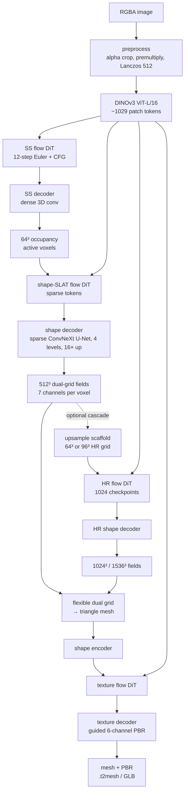
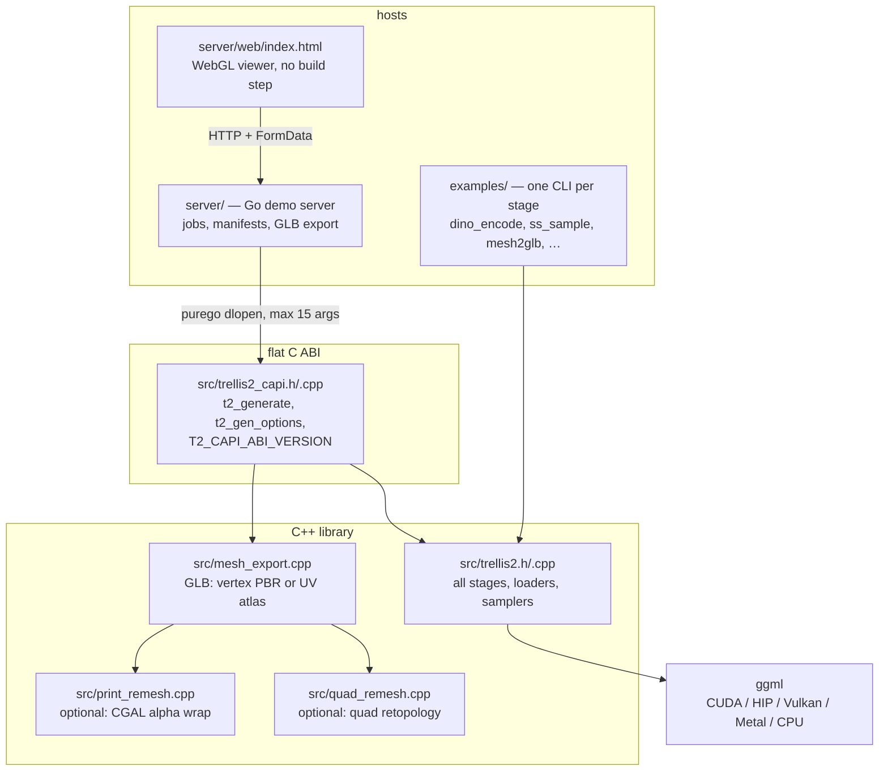
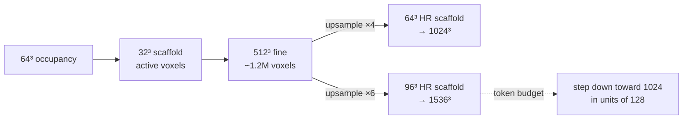
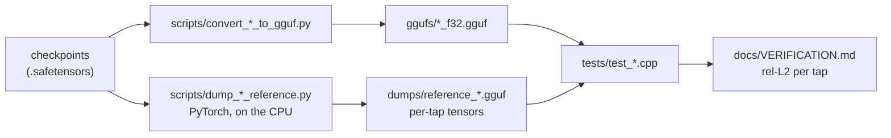

# Architecture — trellis2.cpp

**trellis2.cpp** turns a single image into a textured 3D mesh. It is a
C++/[ggml](https://github.com/ggerganov/ggml) port of Microsoft's
[TRELLIS.2](https://github.com/microsoft/TRELLIS.2) image-to-3D pipeline: no
Python, no PyTorch, no CUDA-only dependency at run time. One shared library, a
flat C ABI, a Go demo server, and a set of CLI tools that each expose one stage.

This directory is the entry point for the architecture documentation. Detailed
documents stay where they are; this file explains how the pieces fit and links
them by topic.

## Authoritative sources

- [`../../AGENTS.md`](../../AGENTS.md) — **the rules**: agent workflow,
  architecture conventions, build commands, naming, licence policy, review
  workflow. Where this document and `AGENTS.md` disagree, `AGENTS.md` wins.
- [`../VERIFICATION.md`](../VERIFICATION.md) — the parity table: which stage is
  verified against what, to which tolerance, on which device.
- [`../PLAN.md`](../PLAN.md) — porting status and stage timings.
- [`../plan/`](../plan/) — planned features, bugs and architecture changes.
- [`../progress/`](../progress/) — result documentation of completed steps.

This document explains *why* the code is shaped the way it is. `AGENTS.md`
states what you must do. The split matters: rules that drift are worse than no
rules, so anything normative belongs there and only there.

## What the software does

The pipeline takes an RGBA image and produces geometry plus PBR material, in
five conceptual moves:

1. **Condition** — a DINOv3 ViT-L/16 encoder turns the image into ~1029 patch
   tokens. Everything downstream is conditioned on these.
2. **Sparse structure** — a diffusion transformer (DiT) samples a latent that a
   dense 3D-conv decoder turns into a 64³ occupancy grid. This is the coarse
   silhouette: *where is there material at all*.
3. **Shape SLAT** — a second DiT samples *structured latents* on the active
   voxels only. A sparse ConvNeXt U-Net decoder then subdivides them 16× to
   512³, emitting seven channels per voxel: three vertex offsets, three
   intersection flags and one quad-lerp weight.
4. **Cascade (optional)** — the 512 result is upsampled to a 1024³ or 1536³
   scaffold and a third DiT refines it at that resolution.
5. **Extract and texture** — a flexible dual-grid mesher converts the seven
   channels into triangles; a shape encoder plus texture flow and decoder
   produce base colour, roughness, metallic and opacity, which are exported as
   vertex colours or baked into a UV atlas.



## How the code is layered

Three layers, each usable without the one above it. That is deliberate: a bug
can be reproduced at the lowest layer that still shows it, which is how every
parity investigation in `docs/progress/` was actually carried out.



**The library** (`src/trellis2.{h,cpp}`, ~5,200 lines) holds every stage. It is
C++ with a decorated API, in the llama.cpp / sam3.cpp tradition: a compact
library, not a framework.

**The C ABI** (`src/trellis2_capi.{h,cpp}`) is a flat, versioned surface for
non-C++ hosts. `T2_CAPI_ABI_VERSION` is bumped whenever any signature or struct
layout changes, and `server/engine.go` checks it at load time — a stale DLL is
refused rather than silently misread.

One constraint shapes this layer more than any design preference: **purego binds
at most 15 arguments.** Growing parameter lists therefore fail at *run time* in
the Go host, not at compile time in C. Both option-carrying calls were converted
to structs after hitting exactly that wall — `t2_glb_options` at ABI 18 and
`t2_gen_options` at ABI 19. New options are struct fields; new signatures are a
last resort.

**The hosts** are interchangeable. The Go server is a demo, not the product; the
CLI tools in `examples/` exercise single stages and are what the tests and the
reference workflow drive.

## Stage structure

Every stage is an independently callable **loader** + **forward** pair:

| loader | forward | what it does |
|---|---|---|
| `trellis2_dino_load` | `trellis2_dino_encode` | image → conditioning tokens |
| `trellis2_ss_flow_load` | `trellis2_ss_flow_forward` / `_sample` | sparse-structure DiT |
| `trellis2_ss_dec_load` | `trellis2_ss_dec_decode` | latent → 64³ occupancy |
| `trellis2_slat_flow_load` | `trellis2_slat_flow_sample` / `_sample_tex` | shape and texture SLAT |
| `trellis2_shape_dec_load` | `trellis2_shape_dec_decode` / `_upsample` | sparse decoder, cascade scaffold |
| `trellis2_shape_enc_load` | `trellis2_shape_enc_encode` | mesh → shape latent (texturing) |
| `trellis2_tex_dec_load` | `trellis2_tex_dec_decode` | guided 6-channel PBR decode |

The loader reads a GGUF file including its `trellis2.<stage>.*` KV metadata; the
forward builds the ggml graph. **This split is what makes the parity method
possible**: any stage can be fed a reference input and its output compared to a
reference output, without running anything before or after it. New stages must
follow the same pattern or they cannot be verified.

## Resolution tiers and the cascade



The 1536 tier reuses the 1024 checkpoints on a larger scaffold. Its HR token
budget (`src/cascade_tokens.h`) can step the achieved resolution back down
toward 1024 in units of 128, so "requested" and "achieved" are separate numbers
and both are reported. `T2_PIPE_AUTO` deliberately never selects 1536: it buys
detail with a much larger decode and a longer run, so it stays an explicit
request.

## Data formats and coordinates

- Meshes live in the **centered unit cube** (`[-0.5, 0.5]³`, same axes as the
  voxel grid). `ss_mesh --normalize` establishes this explicitly.
- Own container formats, all versioned: `.dinodata` (conditioning), `.latent`
  (z_s), `.occ` (occupancy logits), `.t2mesh` (`T2MESH01/02/03`). A format
  change needs a plan, a version bump **and** a read path for the old versions.
- **GGUF** carries the weights. Hyperparameters are KV metadata under
  `trellis2.<stage>.*`; weight tensors keep their original checkpoint names, so
  the converter (`scripts/convert_*_to_gguf.py`) and the loader can be checked
  against each other independently.
- `f16` is the delivery path, `f32` the validation path (`--ftype 0`). Both are
  built for every stage.

## How correctness is established

This is the part of the architecture that is easiest to get wrong, and the part
that has cost this project the most time.

**Parity against PyTorch, per tap.** Reference scripts (`scripts/dump_*.py`,
`scripts/ref_common.py`) run the original implementation and write intermediate
tensors to GGUF. `tests/test_*.cpp` load those, run the corresponding C++ stage
on the same input, and compare with an atol+rtol gate (`tests/parity.hpp`).
`docs/VERIFICATION.md` is the resulting table.



Three lessons are baked into that diagram and are worth stating plainly, because
each was learned the expensive way:

**The reference must be independent of the port.** If both run on the same
backend, a shared defect cancels and the test goes green while both sides are
wrong. Worse — and this actually happened — a defect *only the reference* has
turns a test red and reads as a port defect, sending the search to the side with
nothing to find. On this hardware, numeric reference dumps are produced on the
**CPU**. See
[`../progress/rocm-native-reference_3-slat-dump-and-out7.md`](../progress/rocm-native-reference_3-slat-dump-and-out7.md).

**Provenance is not what the code selects, it is what actually ran.** A backend
selector string, a monkey-patched dispatch table and a library version can each
break that link silently. `backend-parity` D2b and D2c record two live examples.

**Mesh counters are not an accuracy metric.** Boundary and non-manifold edge
counts are a threshold applied to millions of voxels; they answer "does this
mesh look torn", not "is this backend correct". Correctness is judged on taps.
The prettier mesh is sometimes the less faithful one.

## Backends and their sharp edges

ggml selects the first available GPU backend (CUDA / HIP / Metal / Vulkan) with
a CPU fallback. No backend is hardwired, and backend-specific behaviour lives
behind a capability query rather than an `#ifdef`.

That said, the backends are *not* equivalent, and the library carries explicit
workarounds for two measured defects. Both are documented in `docs/bugs/`
because they are upstream problems, not ours:

| Defect | Effect | Mitigation in this port |
|---|---|---|
| `mul_mat` column truncation on ROCm/HIP | output past 2^19 (f32) or 2^21 (f16/bf16) columns is silently left at zero; the graph still reports success | decoder and encoder levels are evaluated in blocks of 2^18 voxels (`chunk_rows_limit`) |
| flash attention accumulates in F16 on HIP | `ggml_flash_attn_ext_set_prec(GGML_PREC_F32)` is ignored; 89.8 % latent sign agreement against exact's 99.9 % | the exact path builds its score matrix in **query blocks**, so it is reachable at cascade token counts (`TRELLIS2_SDPA_BLOCK_MB`) |

The second is the more instructive one. The score matrix at 1024 is 26 GB in one
allocation, which is why the size gate always chose flash there. Splitting along
the *query* axis is exact with no correction term — `soft_max` runs along keys,
so every query row is independent — and it moved the finest-level expansion ratio
from 3.55 into the healthy 4.00–4.04 band. Cost: 2.3× wall clock. It is a
per-job option (`t2_gen_options.attention_mode`, `attention` in the UI), not yet
a default. See
[`../progress/backend-parity_1024-exact-attention.md`](../progress/backend-parity_1024-exact-attention.md).

## Directory structure

Mirrors [`AGENTS.md`](../../AGENTS.md#directory-structure), which is
authoritative if the two drift.

```
trellis2.cpp/
├── src/                             # the library itself
│   ├── trellis2.h / trellis2.cpp    # all stages, loaders, samplers
│   ├── trellis2_capi.h / .cpp       # flat C-ABI for the Go server (ABI version!)
│   ├── mesh_export.h / .cpp         # GLB export: vertex PBR or UV atlas (xatlas)
│   ├── print_remesh.h / .cpp        # optional: CGAL alpha wrap + PBR transfer
│   ├── quad_remesh.h / .cpp         # optional: AutoRemesher quad retopology
│   ├── cascade_tokens.h             # HR token budget / achieved resolution
│   └── pbr_utils.h                  # shared PBR helpers
├── CMakeLists.txt                   # library, options, CGAL probe
├── examples/                        # CLI tools, consumers of the library
│   ├── dino_info, dino_encode       # inspect / produce conditioning
│   ├── ss_flow_info, ss_sample      # stage-1 DiT: metadata / sampling
│   ├── ss_decode, ss_mesh           # occupancy decoder / coarse preview mesh
│   ├── dual_grid_cli                # 7-channel fields → triangle mesh
│   ├── mesh2glb                     # .t2mesh → GLB (also --print)
│   ├── marching_cubes.h             # Freudenthal isosurface, single header
│   └── flexible_dual_grid.h         # dual grid → triangle mesh
├── tests/                           # ctest targets, parity against PyTorch
│   ├── parity.hpp                   # atol+rtol gate, reporting
│   ├── test_*.cpp                   # per stage or per invariant
│   └── ref_*.py                     # reference generators (in ref container)
├── fuzz/                            # libFuzzer harnesses (clang, ASan/UBSan)
├── server/                          # Go demo server + embedded web viewer
│   └── web/                         # self-contained WebGL viewer (no CDN/build)
├── scripts/                         # converters, reference dumps, downloads, demo
├── docker/                          # Dockerfile.demo (CUDA+Go), Dockerfile.ref (PyTorch)
├── third_party/                     # vendored: xatlas, meshoptimizer, tinybvh, autoremesher, stb
├── ggml/                            # submodule (RobertBeckebans/ggml)
├── tools/                           # small helper tools (cloc, yek)
└── docs/
    ├── PLAN.md                      # roadmap: porting status of the pipeline
    ├── VERIFICATION.md              # parity table + reference workflow
    ├── architecture/                # architecture index (this file)
    ├── ideas/                       # idea collection (not a build order)
    ├── bugs/                        # known bugs, optionally with screenshots
    ├── ref/                         # third-party reference implementations
    ├── screenshots/                 # development screenshots
    ├── progress/                    # progress tracking (per phase)
    └── plan/                        # planning documents
```

## Guiding principles

- **Stage isolation over convenience.** Loader + forward per stage, so every
  stage is independently tappable. A stage that cannot be verified alone is not
  finished.
- **A compact library, not a framework.** Decorated public API (`trellis2_` /
  `TRELLIS2_API`, `t2_` / `TRELLIS2_CAPI`), internals in anonymous namespaces.
  Missing decoration breaks the shared build — or worse, only the Go server's
  `dlopen` at run time.
- **No hardwired backend.** Capability queries, not `#ifdef` on the build type.
- **Measure before moving a default.** Several numbers in this codebase were
  inherited rather than derived, and at least one workaround turned out to be a
  no-op. A default chosen from one sample is an extrapolation wearing a
  measurement's clothes.
- **Format and interface changes are planned**, documented, versioned, and ship
  with a read path for what came before.
- **Licence-safe own design.** `AGENTS.md` requires behaviour to be reproduced
  rather than source text adopted. Note that the stated rationale — licence
  incompatibility — does not hold for the TRELLIS.2 references, which are MIT;
  whether the rule is a factual error or an unstated preference for independent
  work is recorded as an open reviewer decision in
  [`../plan/pixal3d-proj-conditioning.md`](../plan/pixal3d-proj-conditioning.md)
  (D0). Until it is settled, the clean-room reading stands.

## Detailed documents

- [`quad-remesh.md`](quad-remesh.md) — the mid-poly quad topology stage: how it
  relates to the Alpha Wrap print path, benchmarks on synthetic and real
  pipeline geometry, and the input defects that break it.
- [`../PLAN.md`](../PLAN.md) — porting status per stage, with the CPU/GPU
  timings that decided where each one runs.
- [`../plan/README.md`](../plan/README.md) — the planning documents, and the
  template new ones start from.
- [`../bugs/ggml-rocm-mul-mat-column-limit.md`](../bugs/ggml-rocm-mul-mat-column-limit.md)
  — the rocBLAS truncation, reduced to a ten-line PyTorch reproducer.
- [`../progress/apple-port-comparison.md`](../progress/apple-port-comparison.md)
  — what two independent forks of the upstream agree and disagree on, and which
  differences are platform workarounds rather than the model.
